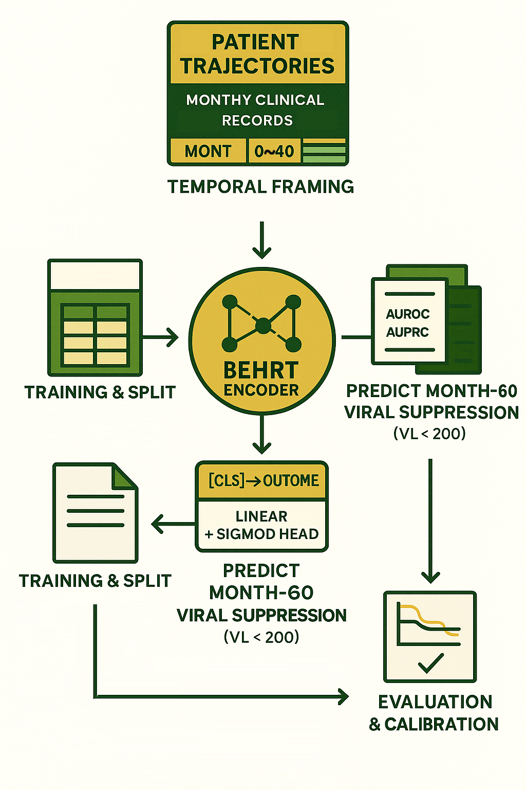

# Blog-001 · Game Plan (2025-10-16)

Dear Nic,

Let’s begin with a clear and minimal plan for implementing BEHRT —  
a BERT-style encoder to model time in longitudinal EHR data.

---

## Step 1 · Patient Split (80/20 by ID)

Split by patient ID to avoid leakage.

```python
rng = np.random.default_rng(seed=42)
ids = np.arange(8916)
rng.shuffle(ids)
trainval_ids, test_ids = ids[:7133], ids[7133:]
````

Use part of `trainval_ids` for validation (stratified by label).

---

## Step 2 · Temporal Framing

Use months 0–39 as input context.
Hide months 40–59 to prevent look-ahead.
Predict outcome at month 60:

* `y = 0` → VL(60) < 200 (success)
* `y = 1` → VL(60) ≥ 200 (failure)

Drop patients without reliable VL@60.

---

## Step 3 · Tokenisation

Each month = a visit segment.
Inside each visit:

* regimen tokens (e.g., INI, NNRTI)
* lab tokens for VL and CD4

Use μ-law binning (K=32) for labs.

```python
def mu_law_bin(x, mu=255, K=32, clip=(p1, p99)):
    ...
```

Add `[CLS]` at the start, pad to `max_seq_len`,
combine embeddings → code + segment + age (+ optional covariates).

---

## Step 4 · Model Head

Feed `[CLS]` → Linear → Sigmoid
Use BCEWithLogitsLoss with class weighting if needed.

---

## Step 5 · Training Protocol

* Optimiser: AdamW
* Scheduler: warm-up + cosine decay
* Regularisation: dropout in attention & FFN
* Early stopping on validation AUROC or AUPRC

Metrics:

* AUROC
* AUPRC
* Accuracy @ 0.5
* Brier Score + calibration curve

---

## Step 6 · Notes

* Exclude months 40–59 entirely from the encoder.
* Cap derived features (*e.g.,* “time since last measure”) at month 39.
* Watch class imbalance and label noise.
* Keep binning consistent across splits.

---

Nic

(Last Edit: 2025-10-16)

P.S.: You love visualisations</br>

