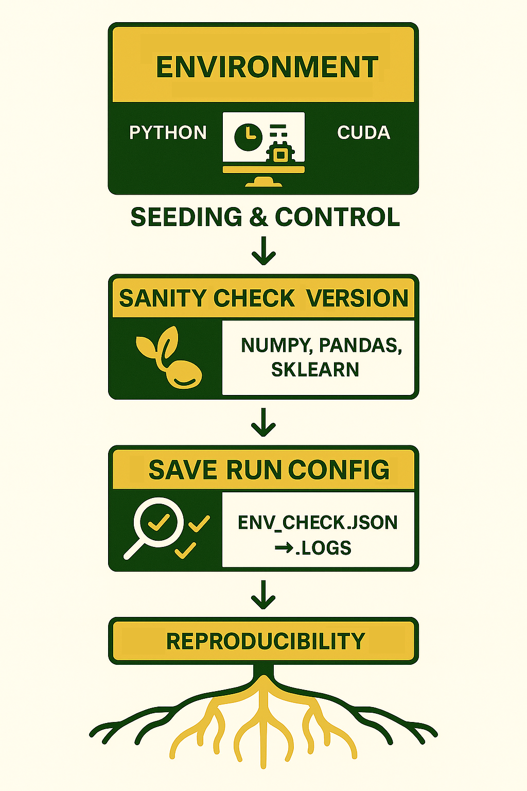

# Blog-002 · Reproducibility Setup (2025-10-17)

Dear Nic,

Let’s lock down the experiment foundations --
imports, seeding, and environment tracking -- so that every run is repeatable and traceable.

---

## Step 1 · Imports

All core dependencies for BEHRT and future models.

```python
# Core
from pathlib import Path
from typing import Any, Dict, List, Optional, Tuple
import json, os, random
import numpy as np, pandas as pd

# Torch
import torch
import torch.nn as nn
from torch.utils.data import Dataset, DataLoader
import torch.backends.cudnn as cudnn

# Training utils
from sklearn.metrics import roc_auc_score, average_precision_score, brier_score_loss
from sklearn.calibration import calibration_curve
from tqdm import tqdm

# Optional: SciPy (safe import)
try:
    import scipy
    from scipy import stats, interpolate
except Exception:
    scipy = None
```

Keep imports consistent across notebooks.
If SciPy isn’t found, continue gracefully.

---

## Step 2 · Seeding and Repro

Set all random seeds and record system metadata.

```python
def seed_all(seed: int = 42, deterministic: bool = True, benchmark: bool = False):
    os.environ["PYTHONHASHSEED"] = str(seed)
    random.seed(seed); np.random.seed(seed)
    torch.manual_seed(seed); torch.cuda.manual_seed_all(seed)
    cudnn.deterministic = bool(deterministic)
    cudnn.benchmark = bool(benchmark)
```

```python
def get_env_info(extra: Optional[Dict[str, Any]] = None) -> Dict[str, Any]:
    import sys, platform
    from datetime import datetime
    cuda_available = torch.cuda.is_available()
    device_count = torch.cuda.device_count() if cuda_available else 0
    device_names = [torch.cuda.get_device_name(i) for i in range(device_count)] if cuda_available else []
    info = {
        "timestamp_iso": datetime.now().isoformat(timespec="seconds"),
        "python_version": sys.version.replace("\n", " "),
        "platform": platform.platform(),
        "torch_version": torch.__version__,
        "cuda_available": cuda_available,
        "cuda_version": torch.version.cuda if hasattr(torch.version, "cuda") else None,
        "cudnn_version": cudnn.version(),
        "num_gpus": device_count,
        "gpu_names": device_names,
        "numpy_version": np.__version__,
        "pandas_version": pd.__version__,
        "scipy_version": getattr(scipy, "__version__", None),
        "tqdm_version": getattr(tqdm, "__version__", None),
    }
    try:
        import sklearn; info["sklearn_version"] = sklearn.__version__
    except Exception: pass
    if extra: info.update(extra)
    return info
```

```python
def save_run_config(out_dir: Path, config: Dict[str, Any], fname: str = "run_config.json") -> Path:
    out_dir.mkdir(parents=True, exist_ok=True)
    out_path = out_dir / fname
    with out_path.open("w", encoding="utf-8") as f:
        json.dump(config, f, indent=2, ensure_ascii=False)
    return out_path
```

Use `seed_all(42)` at the start of every script.

---

## Step 3 · Sanity Check Versions

Print library versions and dump an environment snapshot.

```python
def sanity_check_versions():
    import sys, platform
    print("\n=== Version Sanity Check ===")
    print(f"Python          : {sys.version.split()[0]}")
    print(f"Platform        : {platform.platform()}")
    print(f"Numpy           : {np.__version__}")
    print(f"Pandas          : {pd.__version__}")
    print(f"Torch           : {torch.__version__}")
    print(f"CUDA available  : {torch.cuda.is_available()}")
    if torch.cuda.is_available():
        print(f"CUDA (Torch)    : {torch.version.cuda}")
        print(f"cuDNN version   : {cudnn.version()}")
        for i in range(torch.cuda.device_count()):
            print(f" ├─ GPU[{i}]     : {torch.cuda.get_device_name(i)}")
    try:
        import sklearn; print(f"scikit-learn    : {sklearn.__version__}")
    except Exception: print("scikit-learn    : Not installed")
    if scipy is not None:
        print(f"SciPy           : {scipy.__version__}")
    else:
        print("SciPy           : Not installed")
    print(f"tqdm            : {tqdm.__version__}")
    print("===================================\n")
```

```python
if __name__ == "__main__":
    seed_all(42)
    sanity_check_versions()
    env_info = get_env_info()
    save_run_config(Path("./_logs"), env_info, fname="env_check.json")
    print("Environment info saved to ./_logs/env_check.json")
```

Run once to confirm deterministic settings, CUDA version, and package integrity.

---

## Step 4 · Notes

* Store `_logs/env_check.json` with experiment outputs.
* When migrating to another GPU or environment, re-run this block to compare.
* Keep the same seed for baseline parity (42 by default).

---

Nic

(Last Edit: 2025-10-17)

P.S.: Start robust model grows from stable reproducible roots.

