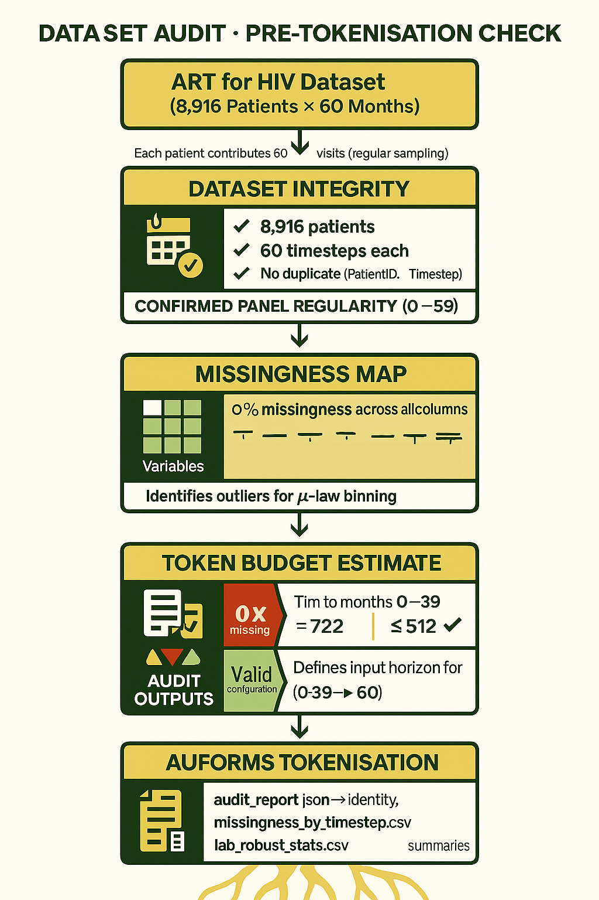

# Blog-003 · Dataset Audit & Pre-Tokenisation Check (2025-10-20)

Dear Nic,

Before modelling BEHRT, we need to verify the structure, completeness, and token budget for the longitudinal [ART for HIV dataset](https://github.com/NicKuo-ResearchStuff/Health_Gym_AI/tree/main/Blogs/Blogs002_Realism).

---

## Dataset Context

The ART for HIV dataset contains 8 ,916 patients for 60 monthly timesteps, fully observed over five years.
Each patient contributes a fixed-length trajectory:

```
PatientID | Timestep | VL | CD4 | Rel CD4 | Gender | Ethnic | Base Drug Combo | …
```

This regular panel is ideal for a BEHRT-style model -- if, and only if, we confirm that every record is consistent.

---

## Audit Configuration

We define a minimal configuration class:

```python
@dataclass
class BehrtAuditConfig:
    id_col = "PatientID"
    time_col = "Timestep"
    expected_timesteps = 60
    labs = ["VL", "CD4", "Rel CD4"]
    categorical_cols = [
        "Gender","Ethnic","Base Drug Combo",
        "Comp. INI","Comp. NNRTI","Extra PI","Extra pk-En"
    ]
    time_tokens = 2  # Δt + TimeSinceStart
```

This single object drives all subsequent checks -- identity integrity, missingness, robust lab stats, and token budget.

---

## Structural Integrity

The audit first confirms that the panel is truly regular:

| Check                                | Result         |
| ------------------------------------ | -------------- |
| Distinct patients                    | 8 ,916         |
| Expected timesteps per patient       | 60             |
| Duplicates (`PatientID`, `Timestep`) | None           |
| Monotonic timesteps                  | All increasing |

---

## Missingness Profile

For every variable × timestep, the script computes the NaN rate; with confirmed 0 % missingness flat across all 60 months.

That means no imputation masks or special `[MISSING]` tokens are required for these variables.
It’s rare in clinical data, but this curated cohort is pristine.

---

## Lab Value Distributions

Next, we inspect value ranges to design our μ-law bins:

| Lab     | p1   | p50  | p99    | Max          | Notes                   |
| ------- | ---- | ---- | ------ | ------------ | ----------------------- |
| VL      | 0.41 | 38.8 | 84 618 | 97 566       | Long-tailed, log-scaled |
| CD4     | 75.9 | 466  | 6 109  | 42 475 | Clip or winsorize       |
| Rel CD4 | 6.1  | 27.7 | 153    | 586          | Acceptable              |

These percentiles define the `[μ=255, K=32]` μ-law compression range later used in tokenisation.

---

## Token Budget Estimate

BEHRT’s context limit is 512 tokens.
We estimate how many our design would use:

```
Tokens per visit = Time(2) + Concepts(7) + Labs(3) = 12
Per patient (60 mo) = 12×60 + 2 = 722  ✗ exceeds limit
```

To fit within 512, we frame only months **0–39** as input:

```
12×40 + 2 = 482  ✓ valid
```

This strict 40→60 horizon also prevents temporal leakage.

## Notes
These steps ensure that the subsequent μ-law discretisation, vocabulary freezing, and model training rest on a trustworthy, reproducible base.

---

Nic

(Last Edit: 2025-10-20)


